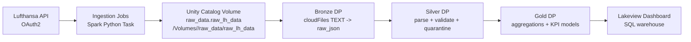

# Architecture

## End-to-end concept
The platform implements a lakehouse pipeline with a Medallion architecture:
- **Raw landing**: API payloads are stored as JSON files in Unity Catalog volumes.
- **Bronze**: Auto Loader ingests files as unstructured JSON strings with file metadata.
- **Silver**: Parsing, standardisation, validation, CDC/SCD, and quarantine outputs.
- **Gold**: Aggregations and KPI tables for dashboards/analytics.

## Architecture diagram (logical)


## Deployment architecture (as code)
Everything deploys as a Databricks Declarative Automation Bundle (formerly Asset Bundle):
- `databricks.yml` defines targets (`dev`, `prod`), the catalog naming convention, schemas, and the managed volume.
- `resources/jobs.yml` defines orchestration workflows, including ingestion, pipeline tasks, dashboard refresh, and bootstrap ordering.
- `resources/pipelines.yml` defines the declarative pipelines and their library entrypoints.
- `resources/dashboard.yml` defines the Lakeview dashboard and binds it to the configured SQL warehouse.

The dashboard warehouse is supplied at deploy time with:

```bash
export BUNDLE_VAR_warehouse_id=<their-id>
```

## Medallion mapping to repo artefacts

### Raw landing
- Code: `src/ingestion/scripts/*.py`
- Storage: UC managed volume `raw_data.raw_lh_data`
- Paths:
  - `.../flight_status/direction=<...>/airport=<...>/date=<...>/window_start=<...>/run_id=<...>/page=<n>.json`
  - `.../reference_data/<type>/date=<...>/run_id=<...>/page=<n>.json`

### Bronze
- Code:
  - `src/transformation/bronze/common.py`
  - `src/transformation/bronze/operational.py`
  - `src/transformation/bronze/reference.py`
- Tables:
  - `bronze.flight_status_raw`
  - `bronze.{airports,airlines,aircraft,cities,countries}_raw`

### Silver
Operational (CDC/SCD2):
- Code: `src/transformation/silver/operational/*`
- Outputs:
  - `silver.flight_status_quarantine`
  - `silver.flight_status_history` (SCD2)
  - `silver.flight_status_current`

Reference (snapshot CDC/SCD1):
- Code: `src/transformation/silver/reference/*`
- Outputs (per entity):
  - `silver.<entity>_quarantine`
  - `silver.<entity>_current`

### Gold
- Code:
  - `src/transformation/gold/departure_airport_hourly_performance.py`
  - `src/transformation/gold/departure_airport_distance_category_daily_performance.py`
  - `src/transformation/gold/route_daily_performance.py`
- Tables:
  - `gold.departure_airport_hourly`
  - `gold.airport_distance_category_daily_performance`
  - `gold.route_daily_performance`

## Key design choices
- Store raw API payloads as files and Bronze JSON strings to be resilient to schema drift.
- Use expectations + quarantine to make data quality behaviour explicit (and measurable).
- Use SCD2 for operational event updates and SCD1 for reference dimensions.
- Keep ingestion, medallion transformations, dashboard configuration, and orchestration in separate bundle resources so each operational concern can evolve independently.
