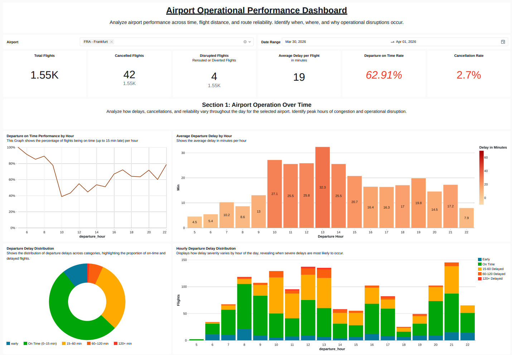

# Dashboard

## Overview
The Airport Operational Performance Dashboard is the serving layer for the Gold tables. It turns the pipeline outputs into an operational view of flight volume, departure reliability, cancellations, route disruption, hourly delay patterns, distance category performance, and route-level performance.

The dashboard is deployed by the Databricks bundle as `airport_ops_dashboard` from:

- `dashboard/Airport-Operational-Performance-Dashboard.lvdash.json`
- `resources/dashboard.yml`

## Preview


Full preview export:
- [preview_dashboard_full.pdf](./preview/preview_dashboard_full.pdf)

## Purpose
The dashboard is designed to answer questions such as:

- How does average departure delay vary by hour?
- What share of departures are on time, delayed, disrupted, or cancelled?
- Do short-, medium-, and long-haul flights behave differently?
- Which routes have the highest delays, cancellations, or on-time performance?
- Which routes have the highest flight volume?

## Data Sources
The dashboard reads from the Gold schema configured by the bundle:

- `gold.departure_airport_hourly`
- `gold.airport_distance_category_daily_performance`
- `gold.route_daily_performance`

It also uses `silver.airports_current` to enrich airport selector labels with airport names.

## Main Views
### Global Filters
The dashboard includes shared filters for:

- Date range
- Departure airport

These filters are applied across the KPI cards, hourly trends, distance category analysis, and route tables.

### KPI Summary
The top-level KPI section summarizes:

- Total flights
- Average departure delay
- Departure on-time performance
- Cancelled flights
- Cancellation rate
- Disrupted flights

### Hourly Performance
The hourly section shows how operational performance changes across the day:

- Average departure delay by hour
- Departure delay category distribution
- Departure on-time rate by hour

### Distance Category Performance
The distance category section compares flight performance across distance bands, including flight volume, average delay, and departure on-time performance.

### Route Performance
The route section highlights route-level reliability and volume:

- Routes with highest average departure delay
- Routes with highest departure on-time performance
- Most frequent routes
- Route performance detail table

## Refresh Flow
The dashboard is refreshed as part of the operational job:

1. `run_operational_entrypoint_py` ingests operational Lufthansa API data.
2. `run_operational_medallion_pipeline` updates Bronze, Silver, and Gold tables.
3. `refresh_airport_ops_dashboard` refreshes the Lakeview dashboard after the pipeline succeeds.


## Deployment Requirement
The dashboard needs a Databricks SQL warehouse for query execution. Set the warehouse id before validating or deploying the bundle:

```bash
export BUNDLE_VAR_warehouse_id=<your-sql-warehouse-id>
databricks bundle validate -t dev
databricks bundle deploy -t dev
```

The bundle passes this value into `resources/dashboard.yml` as `${var.warehouse_id}`.
