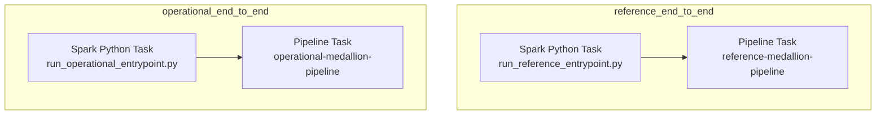
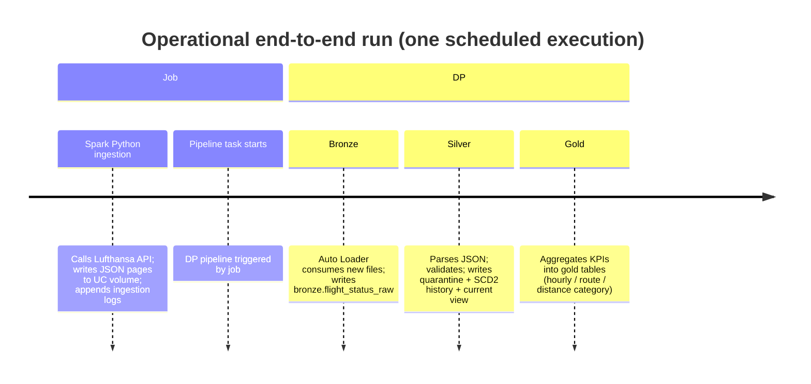

# Pipeline

## Overview
There are two orchestrated end-to-end flows, both defined as Jobs in the bundle:
- `reference_end_to_end`: monthly reference ingestion + reference medallion pipeline
- `operational_end_to_end`: 4-hourly operational ingestion + operational medallion pipeline (includes Gold)

Schedules are currently configured as `PAUSED` (recommended for demos; unpause for production).

## Job schedules (Quartz cron)

### Operational job
- Quartz: `45 5 0/4 * * ?`
- Meaning: every 4 hours at `HH:05:45` UTC (00:05:45, 04:05:45, …, 20:05:45)
- Berlin time (CEST, UTC+2 in early April): 02:05:45, 06:05:45, …, 22:05:45

### Reference job
- Quartz: `0 5 10 1 * ?`
- Meaning: 10:05:00 UTC on day 1 of every month
- Berlin time (CEST): 12:05:00 on day 1

## Task order (end-to-end)

Important dependency:
- Operational Gold distance/haul metrics join `silver.airports_current`.
- Therefore: run `reference_end_to_end` at least once before the first operational run.

## Ingestion details

### Reference ingestion
- Entrypoint: `src/ingestion/run_reference_entrypoint.py`
- Datasets:
  - countries, aircraft, airlines, airports, cities
- Output:
  - JSON pages in `/Volumes/<catalog>/raw_data/raw_lh_data/reference_data/<type>/date=<YYYY-MM-DD>/run_id=<...>/page=<n>.json`
- Logging:
  - `raw_data.ingestion_log_reference_data` (Delta, partitioned by `log_date`)

### Operational ingestion (flight status)
- Entrypoint: `src/ingestion/run_operational_entrypoint.py`
- Strategy:
  - fixed airport list (e.g., FRA, MUC, LHR, …)
  - 4-hour windows for departures and arrivals, including some future windows, to capture updates/delays
  - pagination with `limit` and `offset`
- Output:
  - JSON pages in `/Volumes/<catalog>/raw_data/raw_lh_data/flight_status/direction=<...>/airport=<...>/date=<...>/window_start=<...>/run_id=<...>/page=<n>.json`
- Logging:
  - `raw_data.ingestion_log_flight_status` (Delta, partitioned by `log_date`)

## Declarative pipelines (DP) and table lineage

### Reference medallion pipeline
Libraries executed:
- Bronze: `src/transformation/bronze/reference.py`
- Silver: `src/transformation/silver/reference/{countries,aircraft,airlines,airports,cities}.py`

Outputs:
- Bronze raw JSON tables
- Silver SCD1 “current” dimensions + quarantine tables

### Operational medallion pipeline
Libraries executed:
- Bronze: `src/transformation/bronze/operational.py`
- Silver: `src/transformation/silver/operational/flight_status.py` (SCD2 + current view)
- Gold:
  - `gold.departure_airport_hourly`
  - `gold.route_daily_performance`
  - `gold.airport_distance_category_daily_performance`

## Mermaid timeline (what happens in one operational run)

